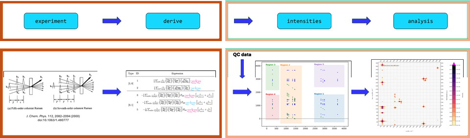
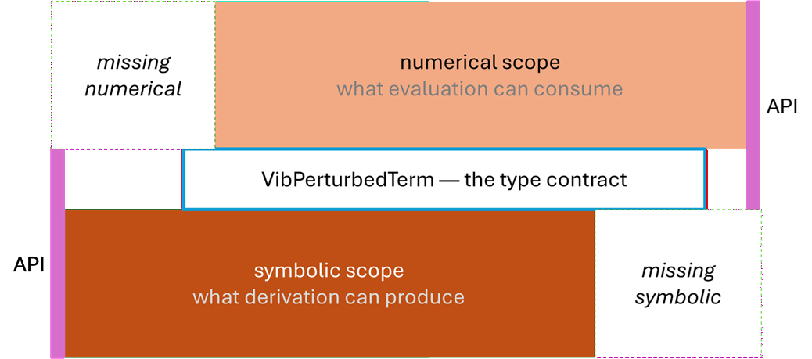

[](https://www.gnu.org/licenses/lgpl-3.0.html)
[](https://www.gnu.org/licenses/lgpl-3.0.html)
[](https://www.gnu.org/licenses/lgpl-3.0.html)

# Wilson

Wilson is a Python package for simulation of vibrational wave-mixing spectroscopy under detuning from electronic resonance:
Its design goal is to derive expressions for contributions to spectral intensities in this category of experiments and
evaluate these as spectra, offering the opportunity for in-depth results analysis by access to the detailed data that results
from the structure and ab initio nature of its implementation.

## Key features

<!-- - Derivation of response function contribution expressions for vibrational wave-mixing spectroscopy experiments. -->

While some core functionality of Wilson is still under development, the list of current and intended features includes:  

- Define spectroscopic experiments via the `wilson-experiment` module in terms of parameters such as pulse configuration, detection method, phase-matching, and polarization
- Derive response function terms symbolically in an "order-open-ended" manner with configurable anharmonicity limits and automatic perturbation expansion via the `wilson-derive` module, 
- Parse force constants, molecular properties, and derivatives usable in the evaluation of the derived terms from the `Gaussian` and `CFOUR` quantum chemistry programs via the `CQCParse` package (external)
- Compute vibrational state energies across harmonic, VPT2, GVPT2, and DVPT2 regimes, with Fermi resonance detection
- Evaluate response function amplitudes for a large variety of experiments in scope numerically on multi-dimensional spectral grids via the `wilson-intensities` module, with localized evaluation near resonances and identification of which vibrational transitions produce resonant features in a given spectral region
- Render 1D and 2D spectra of the spectral results with versatile configuration options for rendering and figure styling
- Run the full symbolic-to-spectrum pipeline through a single simulation container utilizing the `wilson-main` module with built-in validation, diagnostics, and intermediate caching

### Workflow



### Scopes - symbolic vs numerical



## Installation

### From source
1. Get source code
2. Prepare the environment and activate it
3. Install

```
git clone git@github.com:wilson-gv-project/wilson-gv.git
cd wilson-gv
conda env create -f environment.yml
conda activate wilson_gv
pip install .
```

### `CQCParse`  - package for parting quantum chemistry software outputs

The repository is here: [CQCParse](https://github.com/wlevand/CQCParse)

```
git clone git@github.com:wlevand/CQCParse.git
cd CQCParse
pip install .
```

## Quick start

The example below runs the full EVV pipeline for formaldehyde.
This example is also available in a Jupyter notebook form: [`examples/quick_start.ipynb`](examples/quick_start.ipynb).

### 1. Set up a vibrational N-wave mixing experiment

```python
import wilson_suite.wilson_experiment.experiment_abstractions as wexp
from wilson_suite.wilson_derive.derive import get_fully_enhanced_terms
from wilson_suite.wilson_utils.termdict_from_symb_term import derived_terms_flat

# Here: Three pulses at different times, all X axis ("vertically") polarized. Two of the pulses are in the IR range
# and one is in the UV/VIS range. Corresponds to an "EVV" 2D-IR experiment.
pulse_ir_1 = wexp.make_impulsive_gaussian_pulse(tc=50.0, pol=(1.0, 0.0, 0.0), id=1)
pulse_ir_2 = wexp.make_impulsive_gaussian_pulse(tc=100.0, pol=(1.0, 0.0, 0.0), id=2)
pulse_uvvis_1 = wexp.make_impulsive_gaussian_pulse(tc=120.0, pol=(1.0, 0.0, 0.0), cf_uv=0.072, id=3)
field = wexp.ElectricField(pulses=(pulse_ir_1, pulse_ir_2, pulse_uvvis_1))

# Set the detector to detect vertically polarized light with the wavevector -k1 + k2 + k3
detector = wexp.SpecDetector(
    detection_method='freq',
    wv_filter=[{1: -1, 2: 1, 3: 1}],
    detection_polarization=(1.0, 0.0, 0.0),
)

# Create the experiment instance
experiment = wexp.VibExperiment(field=field, detector=detector, scans=(), magn_conditions=((-1, 2),),)

# Derive the relevant contributing terms, here return data as "flat" list for ease of inspection
evv_terms = derived_terms_flat(get_fully_enhanced_terms(experiment), tolistonly=True)
```

### 2. Derive response function terms

Based on the experiment, derive the symbolic response function terms, then
translate them to your chosen spectral axis variables.

```python
import wilson_suite as ws
from wilson_suite.wilson_utils.some_reprs import make_SpectralAxisSet
from wilson_suite.wilson_utils.paths import SUITE_ROOT

# Derive the relevant contributing terms, here return in default structure (ordered by anharmonicity)
terms = ws.derive.derive.get_fully_enhanced_terms(experiment=experiment)

# Make an axis choice using w_1 and (-w_1 + w_2) as the 2D spectrum axes, 
# and translate the contributing terms to these variables A and B 
axis_choice = make_SpectralAxisSet({'A': [1], 'B': [-1, 2]})
translated_terms = ws.derive.term_var_translate.translate_terms_to_axis_variables(terms, axis_choice)
```

### 3. Configure the simulation

```python
from wilson_suite.wilson_utils.wilson_data_obtainer import wilson_data_obtainer
from wilson_suite.wilson_analysis.render.render_utils import NormalizationType
from wilson_suite.wilson_intensities.amplitudes.spectrum_composition import SpectralWindow, Box

# Create a WilsonSimulation instance and add the experiment and (translated to axes choice) terms as attributes
# WilsonSimulation object stores simulation parameters and supports the full workflow from input to evaluation and/or rendering result
sim = ws.main.workflow_abstractions.WilsonSimulation()
sim.addExperiment(experiment)
sim.addTerms(terms=translated_terms)

# Add a molecular system (here formaldehyde) and other related setup information (vibrational energy level regime
# and location of quantum chemical data to be used)
sim.addSystem(ws.main.abstractions.MolecularSystem(name='FORM', natoms=4))
vibana = ws.main.abstractions.VibAnaSetup(system=sim.system, regime='GVPT2', vibana_own_analysis='none')
sim.addVibAnaSetup(vibana)
sim.addPropEvalSetup(eval_uniform=ws.main.abstractions.DataOriginInfo(
    source_type='gaussian',
    lvl_theory='B3LYP',
    basis_set='cc-pVQZ',
    base_file_loc=SUITE_ROOT + '/../data_for_tests/g16_formaldehyde_B3LYPcc_pVQZ.out',
))

# Add spectrum evaluation setup (lineshape parameter, evaluation dynamic range, spectral 
# grid resolution/evaluation window, and further rendering configuration (normalization type and output filename))
sim.addSpecEvalSetup(ws.main.spectrum_abstractions.SpecEvalSetup(
    ev_info=ws.main.spectrum_abstractions.EvaluationInfo(
        Gamma=4.7,
        Gamma_unit='cm-1',
        dynamic_range=500,
        grid_resolution={'A': 700, 'B': 700},
        spectral_window=SpectralWindow(box=Box({'A': (700., 3400.), 'B': (10., 3500.)})),
    ),
    rnd_info=ws.main.spectrum_abstractions.RenderingInfo(
        intensity_normalization_type=NormalizationType.LOG_RATIO,
        filename='evv_spectrum.svg',
    ),
))
```

### 4. Evaluate and render

```python
# Determine which quantum chemical properties are needed to evaluate the contributing terms, obtain them from the
# previously specified source, and specify normal mode inclusion regime
sim.setPropsAndMaxStateLvl()
sim.dressPropsWithSetup()

# [OPTIONAL] Inspect the data requests
data_requests = sim.requestData()
print("Properties needed for evaluation with DataOriginInfo:")
for name, origin in data_requests.items():
    print(f"  {name}  <-  {origin.source_type} {origin.lvl_theory}/{origin.basis_set}")

sim.getResults(obtainer=wilson_data_obtainer)
sim.vib_ana_setup.set_include_modes_list()

# Register the axis choice and the contributing terms "in terms of" this axis choice, then evaluate the spectral amplitudes
sim.axis_choice = axis_choice
sim.terms_in_axis_choice = translated_terms
sim.evaluate()

# Render the spectrum
sim.spec_eval_setup.rnd_info.style_config.figsize = (10, 10)
sim.render_spectrum(do_diagn=False)
# spectrum saved to evv_spectrum.svg
```


## Documentation

No comprehensive documentation for Wilson is yet available but is intended to be manifested both in terms of existing and future in-code comments,
tutorials and usage examples such as the one shown above, journal publication and in online technical document form.

